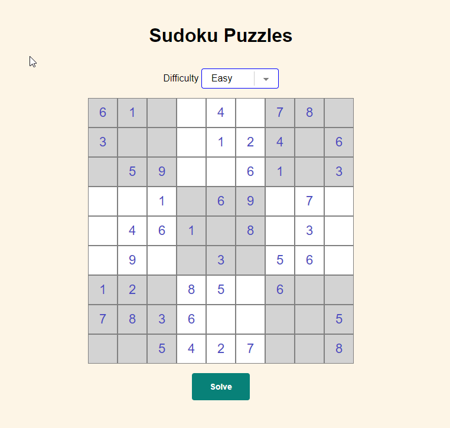
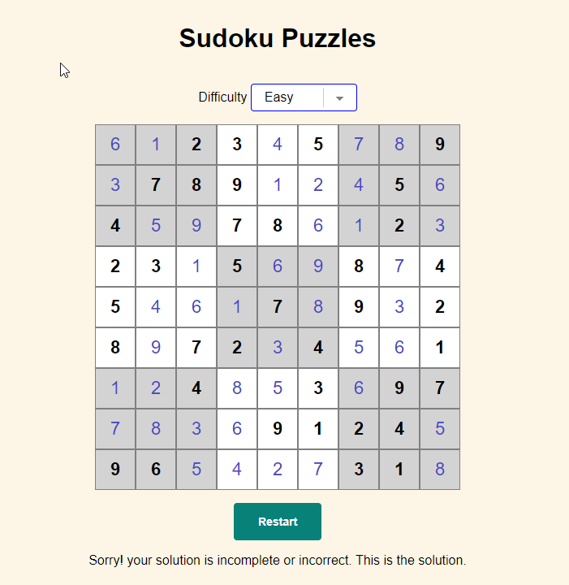

# Sudoku Solver Game

Sudoku solver game with random puzzles having three difficulty levels (easy/medium/hard). Solve puzzles by own and see your result by clicking solve button.

## Screens

Initial Game Screen


Solved Game Screen


## Game Guidelines

- Select difficulty level from dropdown to refresh sudoku puzzle
- Solve by your own or click solve button to see the result
- You will see result with solution or a not solvable message appear (if provided inputs do not lead to a solution).
- Press `Restart` Button to generate new puzzle


## Project Usage

### Install dependencies

```bash
npm install
```

### Add RAPID API Key

Rename **.env.example** to **.env** and add the Rapid api key

- RAPID_API_KEY = "YOUR SECRET KEY"

### Run server on http://localhost:8000

```bash
npm run start:backend
```

### Open index.html